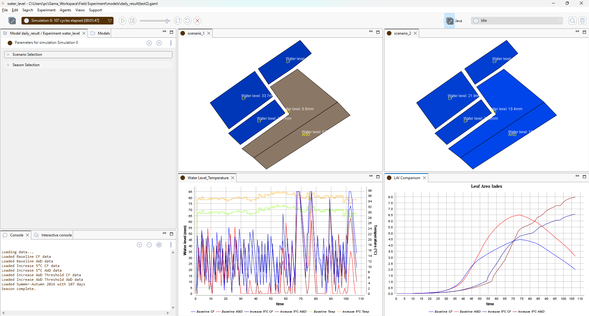
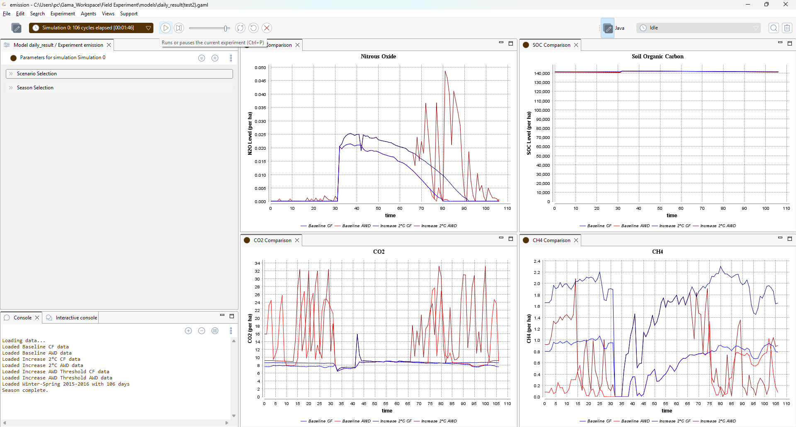

# Table of Contents
1. Introduction
2. Simulation platforms
	1. ORYZA
		1. Prepare for the inputs
		2. Scenario
		3. Run the simulation
	2. GAMA
		0. Format processing
		1. daily_result model
		2. seasonal_result model
		3. eco model


# Introduction

This repo combines **crop simulation modeling** with **agent-based modeling** to understand both the rice performance and socio-economic adoption patterns of different water management strategies in rice farming.

In this experiment, I want to compare 2 water management practices (Continuous Flooding & Alternate Wetting and Drying) to see how it affects on the rice yield, water usage, emissions. And then a farmer decision-making model will simulate the decision of farmer whether to choose CF or AWD based on the economic aspects.

2 Irrigation practices for comparison
**Continuous Flooding (CF)**: 
	The traditional method where rice fields (paddies) are kept continuously flooded with 5-10 cm of standing water throughout most of the growing season
    **Advantages**:
    - Familiar to farmers (traditional practice)
    - Suppresses weeds effectively
    - Generally stable yields
    - Lower risk of crop stress
    **Disadvantages**:
    - Very high water consumption (can use 1,500-2,000 mm of water per season)
    - Higher methane emissions
    - Not sustainable in water-scarce regions

**Alternate Wetting and Drying (AWD)**:
	A water-saving technique where irrigation water is applied to flood the field, then allowed to dry down to a certain level (usually 15 cm below soil surface) before re-flooding
	 **Advantages**:
    - Saves 15-30% water compared to CF
    - Reduces methane emissions
    - Can maintain yields if managed properly
	 **Disadvantages**:
    - Requires more careful monitoring
    - Risk of yield reduction if soil dries too much
    - Farmers may be hesitant to adopt (unfamiliar practice)
    - Requires proper drainage infrastructure
    - 
I compared double-rice season (Winter-Spring and Summer-Autumn) with 2 water management practices under 3 scenarios from 2015 to 2020 in Kien Giang (old)
- Baseline (in normal condition)
- Temperature rises 2℃
- AWD Threshold Changing (let the field drain more)

# Simulation platform
## ORYZA
A platform that simulate rice crop growth based on inputs like weather, soil type, management practices.
### Preparing the ORYZA Simulation inputs

 - **Weather data**: All the weather data for this simulation is placed in this folder ```oryzatrain\test_data\ORYZA_weather_data\rach_gia```. 
	In ORYZA, weather data file format is organized by **<station_name><station_code>.<year_of_weather_data>**
		
	Here's what the weather file looks like in ORYZA format
	
	There are 9 columns in each weather file
	Column	Weather variable	               Unit
		(1) 	Station number		
		(2)	Year
		(3)	Day of year
		(4)	Solar Radiation		       KJ/m2/day
		(5)(6)Min/Max Temperature	   *C	
		(7)	Vapor Pressure		               kPa
		(8)	Wind Speed		                   m/s
		(9)	Rainfall		                       mm

	At the first row of each weather file, it contains information of weather station: longitude; latitude; height, and 2 Angstrom parameters

- **Soil file (standard.sol)**: This soil file contains soil properties of simulation area. In this simulation, I used soil file provided by Alexandre with the assumption that the place of the soil file has the same properties with simulation place since we haven't got the actual soil data yet

- **Crop file (IR72.crp)**: This crop file contains rice type properties provided by IRRI

- **Experimental file (standard.exp)**: This file lets you define and set up planting, irrigation and fertilization schedule for rice management. However, for this experiment, we do not run this file directly. Instead, we use **rerun file (.rer)** to control the specific irrigation treatments

- **Rerun files (.rer)**: These are the main files you will run. They tell ORYZA to:
	1. Load the **standard.exp** file as a base template.
	2. Override the default water management section with a new, specific schedule

	This is how we compare CF and AWD. You can find these rerun files in a location like 
	 ```oryzatrain\scene1\CF_s1.rer``` or ```oryzatrain\scene1\AWD_s1.rer```
	 
	For **Continuous Flooding (CF)**: We use a rerun file like```CF_s1.rer```. In this file, the irrigation schedule is set to apply water frequently to keep the ponding water level high (e.g., irrigate when water is below 2 cm)
 	```
	IRMTAB = 0.0, 2.0,   ! Keep the plot flooding
	        85.0, 0.0   ! Drain the plot before harvesting
 	```
	For **Alternate Wetting & Drying (AWD)**: We use a rerun file like ```AWD_s1.rer```. In this file, the irrigation schedule is delayed until the soil water potential reaches to threshold that equivalent to -15 cm
 	```
	IRMTAB = 0.0, 2.0,    ! Keep the plot flooding
            8.0, 3.0,    ! After 1 week switch to AWD
           60.0, 2.0,    ! Keep the plot flooding during flowering
           72.0, 3.0,    ! Switch to AWD
           85.0, 0.0     ! Drain the plot for harvesting
 	```
	 In the both above code blocks, we use```IRMTAB```as an irrigation option switching table and it has 2 columns
 	 ```
	 IRMTAB = <day after emergence>, <irrigation option>,
		 = <day after emergence>, <irrigation option>
 	 ```	
	where the first column is value based on the day after rice planting, second column is irrigation option (SWITIR). In this case, each irrigation option (SWITIR) is defined in standard.erp file. For example, the ruled for second irrigation (2) is defined as following:
 	```
	IRRI2=50. ! Real Value
	WL0MIN=20. ! Real Value, irrigate when water is below 2 cm
 	```
	where ```IRRI2``` is the amount of irrigation (mm) and ```WL0MIN``` is the minimum standing water (mm). And the ruled for third irrigation (3) is defined as following:
 	```
 	IRRI3=50. ! Real Value
	KPAMIN=10. ! Real Value
	SLMIN3=2 ! Integer Value, Unit: KPa
 	```
 	where ```IRRI3``` is the amount of irrigation (mm) and ```KPAMIN```is critical soil water potential at          layer ```SLMIN3``` (AWD Threshold). ```SLIMIN3``` is soil layer for critical value of ```KPAMIN```. 
 	 
### Scenarios

You will run the CF and AWD simulations for each of these scenarios to compare their performance
	1. **Baseline**: This uses the normal weather data and the standard AWD threshold
	2. **Temperature rises 2℃**: This uses a rerun file that has been modified the weather module to raise the temperature to 2℃ (Apply for both CF and AWD)
	3. **AWD Threshold changing**: This scenario only applies to the AWD simulation. The soil water potential has been modified to simulate the lower threshold (e.g., -20cm or -25cm) and let the field drain more

### How to run the simulation

Select your scenario by choose the corresponding path. I've created 3 folders for 3 scenarios and each folder has 2 rerun files: CF, AWD.
Scenario 1: ```\oryzatrain\scene1\CF_s1.rer```
		```\oryzatrain\scene1\AWD_s1.rer```
Scenario 2: ```\oryzatrain\scene2\CF_s2.rer```
		``` \oryzatrain\scene2\AWD_s2.rer```
Scenario 3: ```\oryzatrain\scene3\CF_s3.rer```
		```\oryzatrain\scene3\AWD_s3.rer```
For example, if you want to simulate **CF** practice when **the temperature rises 2℃**, you will set path of that scenario and practice control file (```CONTROL.DAT```). 
This file used to control the simulation of ORYZA (Input/Output file path and options for output display)
```
	CONTROLFILE = 'CONTROL.DAT'
	FILEON = '.\res.dat'             ! Output file
	FILEOL = '.\model.log'           ! Log file
	FILEIT = '.\standard.exp'        ! Experimental data
	FILEI1 = '.\IR72.crp'       ! Crop data
	FILEIR = '.\scene2\CF_s2.rer'    ! Rerun file contains scenario and practice which you want to simulate
	FILEI2 = '.\standard.sol'        ! Soil data
```
And there is an executable file (```ORYZA35.exe```), you will run this program to execute the simulation by running this command inside the **oryzatrain** folder terminal
```
.\ORYZA35.exe
```
When the simulation is complete, it will generate 2 output files op.dat and res.dat.
1. **res.dat**: contains the detailed simulation results of the model in the daily time step
2. **op.dat**: contains the summary or end-of-simulation values (yields, crop duration, etc.)

Here's the list of variables in **res.dat** and **op.dat** files 

**res.dat**

| Variable name | Unit    | Definition                                                                              |
| ------------- | ------- | --------------------------------------------------------------------------------------- |
| TIME          |         | Accumulative day number starting from Jullian day of simulation starting                |
| DVS           |         | Development stage number                                                                |
| TMIN          | ℃       | Daily minimum temperature                                                               |
| TMAX          | ℃       | Daily maximum temperature                                                               |
| LAI           |         | Leaf area index                                                                         |
| IR            | mm/d    | Amount of daily irrigation                                                              |
| WL0           | mm      | Depth of surface water                                                                  |
| CO2C          | Kg C/ha | Daily CO2 emission                                                                      |
| CH4C          | Kg C/ha | Daily CH4 emission                                                                      |
| N2ON          | Kg N/ha | Daily N2O emission                                                                      |
| SOC           | Kg C/ha | Daily organic carbon total in soil profile                                              |
| SON           | Kg N/ha | Daily soil organic nitrogen total in the soil profile                                   |
| DOY           |         | Julian day in a year                                                                    |
| CROPSTA       |         | Crop growth status: 1 for sowing, 2 for seed bed, 3 for transplanting, 4 for main field |
**op.dat**

| Variable name | Unit    | Definition                                              |
| ------------- | ------- | ------------------------------------------------------- |
| RUNNUM        |         | Number of runs in the simulation (depends on rerun set) |
| WRR14         | kg/ha   | Grain yield with 14% moisture                           |
| WAGT          | kg/ha   | Dry weight of above-ground plant organs                 |
| RAINCUM       | mm      | Accumulative rainfall in main field                     |
| IRCUM         | mm      | Accumulative irrigation in main field                   |
| SOC           | kg C/ha | Soil organic carbon content at the end of season        |
| SON           | kg N/ha | Soil organic nitrogen content at the end of season      |
| S_CH4C        | kg C/ha | Seasonally accumulative CH4 emission                    |
| DAE           |         | Days after emergence                                    |

### GAMA

After running ORYZA simulation, I use GAMA to visualize the results from ORYZA and also as an input for the farmer decision making model.

ORYZA output files have```.dat```format so it is not easy for GAMA to process them. Hence, there are 2 python script files in```python-script```directory used to convert them: ```process_op.py```;```process_res.py```. You can modify the path of input file and output file as you want at the last code line

In ```process_op.py```
```df1 = convert_opdat_to_csv('<input path of op.dat>', '<output path of csv>')```
In ```process_res.py```
```df1 = convert_res_to_csv('<input path of res.dat>', '<output path of csv>')```

For the use of GAMA model, there are 3 GAMA files: ```seasonal_result.gaml```,```daily_result.gaml```,```eco_model.gaml```

1: ```seasonal_result.gaml,```
This GAMA model will visualize the seasonal result (op file) for all 3 scenarios including **Rice Yield; Irrigation; Methane Emission**. 
There are 3 experiments corresponding to 3 indicators. 


	                 Irrigation Experiment for water-use visualization

You can change the path of each op file as you want in```action load_data```
```
action load_data {
	cf_s1 <- csv_file("../includes/Results/CF_s1/cf_op.csv");
	cf_s2 <- csv_file("../includes/Results/CF_s2/cf_op.csv");
	cf_s3 <- csv_file("../includes/Results/CF_s3/cf_op.csv");
	awd_s1 <- csv_file("../includes/Results/AWD_s1/awd_op.csv");
	awd_s2 <- csv_file("../includes/Results/AWD_s2/awd_op.csv");
	awd_s3 <- csv_file("../includes/Results/AWD_s3/awd_op.csv");
}
```
2: ```daily_result.gaml```
This GAMA model will visualize the daily result (res file) and you can choose 2 scenarios to compare the water level, Leaf Area Index (LAI), emission in a selected season together. 
There are 2 experiments: water_level, emission 

	a. **water_level**
		This experiment contains plot map to visualize the water level for 2 practices. It also has 2 charts to show water level and LAI
		
		You can select Scenario and Season to compare the result (reload experiment is required). In Season selection, I still use the season index for selection 
	b, **emission**
		This experiment contains 4 charts corresponding for 4 indicators that could be simulated in ORYZA: NO2; CO2; Soil Organic Carbon, CH4
		
		You can select Scenario and Season to compare the result (reload experiment is required)
	
3: ```eco_model.gaml```
This GAMA model will use the seasonal results (yield simulation results) as an aspect for the farmer to make a practice decision after a season. However this model only compare 2 practices in a scenario, if you want to compare in other scenarios you have to change the path of op file in ```action load_data```
```
action load_data {
	cf_s1 <- csv_file("../includes/Results/CF_s1/cf_op.csv");
	awd_s1 <- csv_file("../includes/Results/AWD_s1/awd_op.csv");
}
```
So there are 10 rice seasons which are Winter-Spring and Summer-Autumn (double rice) from 2015 - 2020. 

At the beginning of the simulation (Winter-Spring 2015-2016), we initialize a number of farmers who use AWD practice (in this case is 40). Then after every season, CF farmers will compare their own income to the average income of nearby AWD farmers. If the AWD farmers' average income is higher by a certain threshold, the CF farmer will consider switching

In this model, there are 2 species
1. Plot
2. Farmer

1: Plot
	Created and got info from the shapefile which has
		land_use
		area
		plot_id
2: Farmer 
	Each farmer owns a plot and they can decide which practice they will apply on their plot (AWD or CF)
	For the economic aspect, each farmer has
	- Revenue
	- Cost 
	- Profit
	Revenue of each farmer is calculated by the yield multiplies with farmer area and rice price.
	```
	current_revenue <- current_yield * (my_plot.area) * rice_price; // yield(kg/ha)*area(ha)*price(VND/kg)
	```
And on the market, there are some factors relating to price/cost. These factors you can change during the simulation
	- Rice price
	- Fertilizer cost, seed cost, other cost
	
The unit for economic factors is VND

The simulation visual has 3 elements:
- Plot window: Visualize the change of irrigation practice by farmer
- AWD Adoption rate chart: Percentage of farmer switching to AWD
- Income per ha: The change of farmer income per ha between 2 practices


